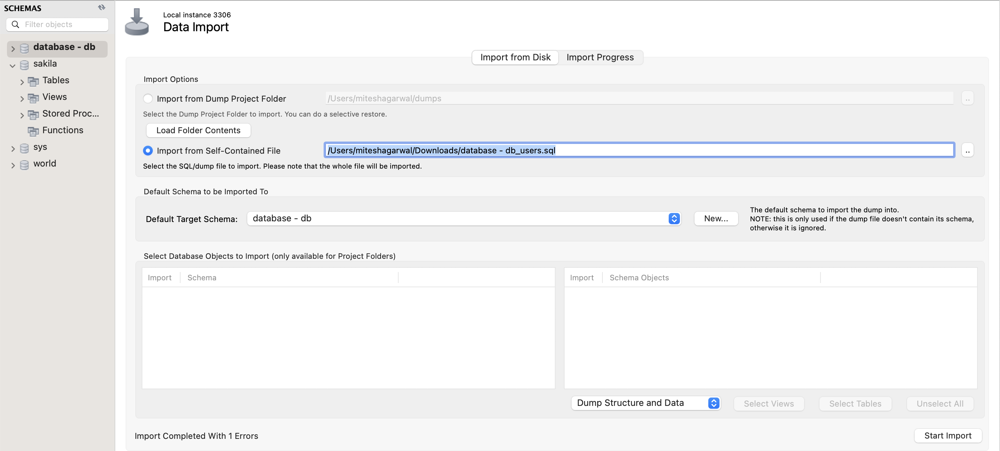
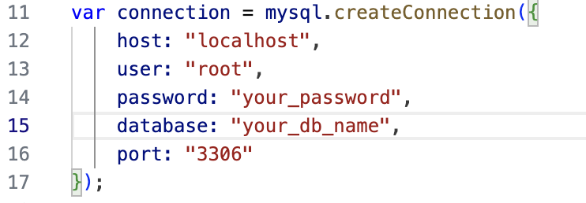

<p align="center"></p>


[](https://zenodo.org/badge/latestdoi/431326985)


[](https://codecov.io/gh/ChaitanyaS182k/Slash)

On the hunt for incredible online deals? Meet Slash, your savvy shopping sidekick!

Slash, the openly accessible web API framework, empowers you to scour the top e-commerce sites for unbeatable deals on your favorite items across a multitude of online shopping destinations. Currently supported websites include [Amazon](https://www.amazon.com/), [Walmart](https://www.walmart.com/), [Target](https://www.target.com/), [BestBuy](https://www.bestbuy.com/), [Costco](https://www.costco.com/) and [EBay](https://www.ebay.com/).

- **Efficient**: Slash streamlines the deal comparison process, potentially saving you more than 50% of your valuable time.
- **User-Friendly**: Slash offers user-friendly public APIs for effortlessly filtering, sorting, and searching through search results.
- **Versatile**: It generates JSON responses that you can easily tailor to achieve the specific outcomes you want.

---

## :rocket: What's new? 
We have added a lot of new features to slash in our Phase-II.

1. A web interface for users to interact with the application in a more personalised way.
2. Substituted web scraping with website product APIs for enhanced efficiency and speed.
3. Added a new e-commerce website [Home Depot](https://www.homedepot.com/)
4. Added the reviews section where users can see review of the product on respective e-commerce website.

## :page_facing_up: Why

1. **Anti-Web Scraping Measures**
   - **Challenge**: Many popular websites, including Amazon and Walmart, employ anti-web scraping mechanisms, making it difficult to extract data using conventional scraping methods.

2. **Transition to APIs**
   - **Solution**: To overcome this challenge, we've transitioned from traditional web scraping in the backend to leveraging official APIs provided by these websites. This strategic shift not only preserves the project's core functionality but also enhances its robustness.

3. **Enhanced Data Reliability**
   - **Benefit**: APIs deliver data in a structured and reliable format, reducing the risk of unexpected data disruptions. In contrast, web scraping is vulnerable to frequent changes in website structure, which can break scraping scripts. This transition ensures more dependable and consistent data access.

These changes have significantly improved the reliability and sustainability of data retrieval in our project.

Future possibilities encompass the development of web applications with intuitive interfaces and mobile applications for Android and iOS, all powered by these web APIs. Anyone can construct their custom applications atop this foundation of web APIs.".

---

<p align="center">
  <a href="#movie_camera-checkout-our-video">Checkout our video</a>
  ::
  <a href="#rocket-installation">Installation</a>
  ::
  <a href="#computer-technology-used">Technology Used</a>
  ::
  <a href="#bulb-use-case">Use Case</a>
  ::
  <a href="#file_cabinet-api">APIs used in the Project</a>
  ::
  <a href="#golf-future-roadmap">Future Roadmap</a>
  ::
  <a href="#sparkles-contributors">Contributors</a>
  ::
  <a href="#email-support">Support</a>

</p>

---

## :movie_camera: Checkout our video


<p align="center"></p>
Also, you can watch the video demo of the Slash project here https://youtu.be/XH2iKbnvyMs.


---

## : Requirements
1. [Visual Studio Code](https://code.visualstudio.com/download)
2. Python 3.7 and above
3. [Node.js](https://nodejs.dev/en/download/) and NPM
4. [MySQL Workbench](https://dev.mysql.com/downloads/mysql/)

## :rocket: Installation

1. Clone the Github repository to a desired location on your computer. You will need [git](https://git-scm.com/) to be preinstalled on your machine. Once the repository is cloned, you will then `cd` into the local repository.

```
git clone https://github.com/secheaper/slash.git
cd slash
```

2. This project uses Python 3 for the backend and React along with Javascript framework for the frontend. This project employs MySQL Workbench to authenticate the users hitting on the frontend.

For the backend setup ensure that [Python](https://www.python.org/downloads/) and [Pip](https://pip.pypa.io/en/stable/installation/) are preinstalled. All the python requirements of the project are listed in the `requirements.txt` file. Use pip to install all of those.

```
pip3 install -r requirements.txt
```

For the frontend setup ensure that [Node](https://nodejs.org/en/) is preinstalled. All the node requirements are listed in `client/package.json` file. Use npm to install all of those.

```
cd client
npm install --legacy-peer-deps
```

For the login page setup, to install all the requirements which are listed in 'LoginPage/package.json' file. Use npm to install all of those.

```
cd LoginPage
npm install express
npm install mysql
npm install cors
npm install nodemon
```

For MySQL Workbench setup, 
Importing db schema
   <p align="center"></p>
Changing db credentials from services.js
   <p align="center"></p>
Facing Issues?
   Refer to the link below for resolution
   https://stackoverflow.com/questions/50093144/mysql-8-0-client-does-not-support-authentication-protocol-requested-by-server


3. Once all the requirements are installed, you will have to `cd` into the `src` folder. Once in the `src` folder, use the python command to run the `main.py` file.

```
cd src

For Mac
python3 main.py

For Windows
python main.py
```

4. Once the backend is up and running, you will have to `cd` into the `LoginPage` folder. Once in the `LoginPage` folder, use the node command to start the webserver.

```
cd LoginPage
nodemon services.js

Open Login.html in the web browser
```


## :computer: Technology Used

- FastAPI : https://fastapi.tiangolo.com
- ASGI Server - Uvicorn : https://www.uvicorn.org


## :bulb: Use Case

- **_Students_**: Students coming to university are generally on a budget and time constraint and generally spend hours wasting time to search for products on Websites. Slash is the perfect tool for these students that slashes all the unnecessary details on a website and helps them get prices for a product across multiple websites.Make the most of this tool in the upcoming Black Friday Sale.
- **_Data Analysts_**: Finding data for any project is one of the most tedious job for a data analyst, and the datasets found might not be the most recent one. Using slash, they can create their own dataset in real time and format it as per their needs so that they can focus on what is actually inportant.

## :file_cabinet: API

Here are the APIs used in our project:

- **Amazon**: [Amazon API Documentation](https://www.rainforestapi.com/)

- **Walmart**: [Walmart API Documentation](https://www.bluecartapi.com/walmart-product-data-api)

- **Target**: [Target API Documentation](https://www.redcircleapi.com/target-product-data-api)

- **The Home Depot**: [The Home Depot API Documentation](https://www.bigboxapi.com/)

- **Ebay**: We used the Ebay SDK, which can be found in the project's requirements. Please refer to the SDK's official documentation for more information.

  - **Ebay SDK Documentation**: [Ebay SDK Documentation](https://developer.ebay.com/support/kb-article?KBid=84)

Please refer to these API documentation links for details on how to use them in our project.

## :golf: Future Roadmap

- Host website on a public server so customers can use it
- Add login feature to store user history to provide features like bookmarking, price drop alerts and many more.
- Our API can be used by end users such as developers who are tech-savvy individuals looking to get a one stop solution for web scraping ecommerce websites such as Amazon, Target, Ebay,etc along with API access to multiple ecommerce websites. It'll be available directly for access to people without having to dive deep into the code.
- Chrome Extension using the functionalities of Slash API
- An iOS or Android application.

# Team Members

## Phase 2 Team Members

- [Chaitanya Srusti](https://github.com/ChaitanyaS182k)
- [Nisarg Doshi](https://github.com/Nisarg20)
- [Aniruddha Rajnekar](https://github.com/Aniruddha-Rajnekar)
- [Mitesh Agarwal](https://github.com/mitesh24100)

## :email: Support

For any queries and help, please reach out to us at: SEslash007@gmail.com
